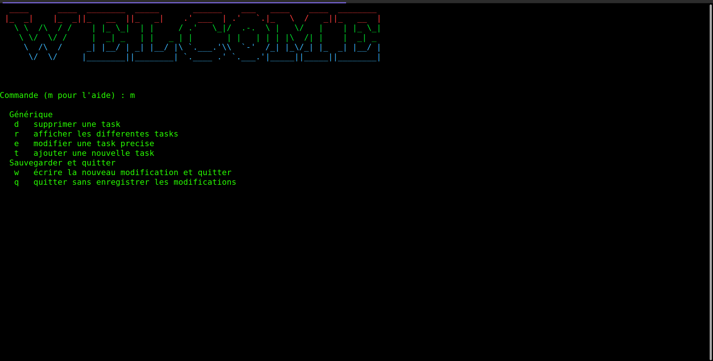

# My Project

This is a simple project that allows you to create a to-do list using shell scripting.

## Description

This project is a command-line tool that helps you keep track of your tasks by creating a to-do list. It allows you to add, remove, 
and view tasks with ease, all from the comfort of your terminal. This project is perfect for anyone who wants a simple and effective way to manage their
tasks without the need for a graphical user interface.

##Prerequisites
This project requires that you have a Linux-based operating system with Bash shell installed.

##Installation
To install this project, simply clone the repository from GitHub using the following command:

  git clone https://github.com/your-username/todo_list.git

U#usage

To use the to-do list, navigate to the project directory in your terminal and run the following command:

./todo.sh

Here is an example of how to use my project:

## Contributing

If you would like to contribute to this project, please follow these steps:

1. Fork the repository
2. Create a new branch: `git checkout -b my-new-feature`
3. Make your changes and commit them: `git commit -am 'Add some feature'`
4. Push to the branch: `git push origin my-new-feature`
5. Create a new pull request

## License

This project is licensed under the MIT License. See the [LICENSE](LICENSE) file for details.
